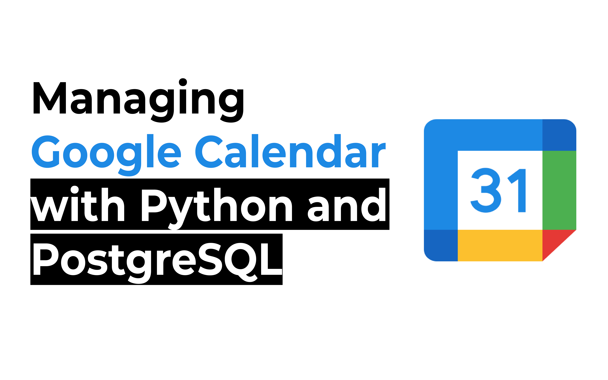

# Managing Google Calendar with Python PostgreSQL, and Streamlit

<p style="text-align:center;">
    
</p>

This repository contains a Streamlit-based web application for managing events across Google Calendar and a PostgreSQL database. The app allows users to create, view, and delete events while ensuring synchronization between Google Calendar and PostgreSQL. The app also provides an interactive calendar interface for visualizing events.

---

## Project Structure

The repository is structured as follows:

- `app.py`: The main Streamlit app file containing the code for managing events and displaying the calendar interface.
- `pg_credentials.txt`: A file containing PostgreSQL database credentials.
- `api_credentials.json`: A file with Google API credentials for accessing the Google Calendar API.
- `requirements.txt`: This file lists all the Python libraries and dependencies needed to run the project.


## Usage

To use this project, follow these steps:

### Installation
1. Clone this repository to your local machine:
   ```bash
   git clone https://github.com/your-repo/Google-Calendar-Python.git
   cd Google-Calendar-Python
   ```
2. Create a new python/conda envirnonment
- **Python**
  - Install a virtual environment
  ```python
  pip install virtualenv
  ```
  - Create a new directory, go into that directory and create your virtual environment. Here's an example:
   ```python
   mkdir new_folder
   cd new_folder

   python -m venv <virtual-environment-name>
   ```
   - Activate your environment
   ```python
   Scripts/activate.bat //In CMD
   Scripts/Activate.ps1 //In Powershel
   ```
   - Run the command below to confrim your virtual environment has been setup.
   ```python
   pip list
   ``` 

- **Conda**
  - Create a new directory, go into that directory and create your virtual environment. Here's an example:
   ```python
   mkdir new_folder
   cd new_folder

   conda create --name <env-name> python==3.10 -y
   ```
   - Activate your environment
   ```python
   conda activate <env-name>
   ```
   - Run the command below to confrim your virtual environment has been setup.
   ```python
   conda list
   ```

3. Install the neccessary libraries by running the command below:
    ```bash
    pip install -r requirements.txt
    ```
4. Add your PostgreSQL credentials in a pg_credentials.txt file:
   ```text
   hostname = 'your-host'
   database = 'your-db'
   username = 'your-username'
   pwd = 'your-password'
   port_id = 5432
   ```
5. Add your Google API credentials in an api_credentials.json file by following the steps [here](https://medium.com/@ayushbhatnagarmit/supercharge-your-scheduling-automating-google-calendar-with-python-87f752010375).

6. Launch the app using Streamlit:
    ```bash
    streamlit run app.py
    ```